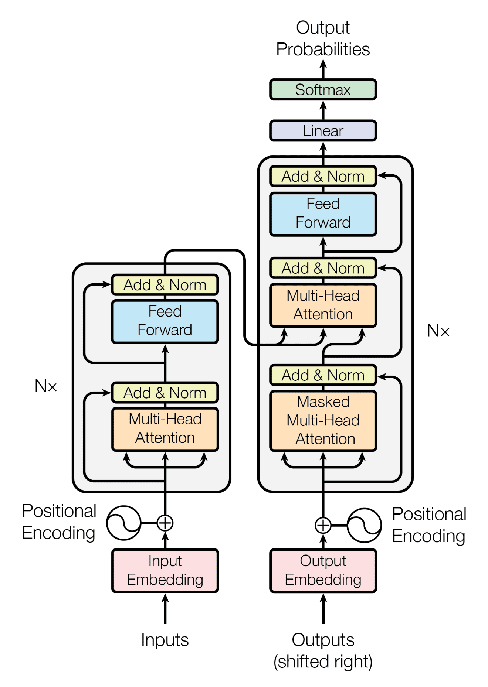
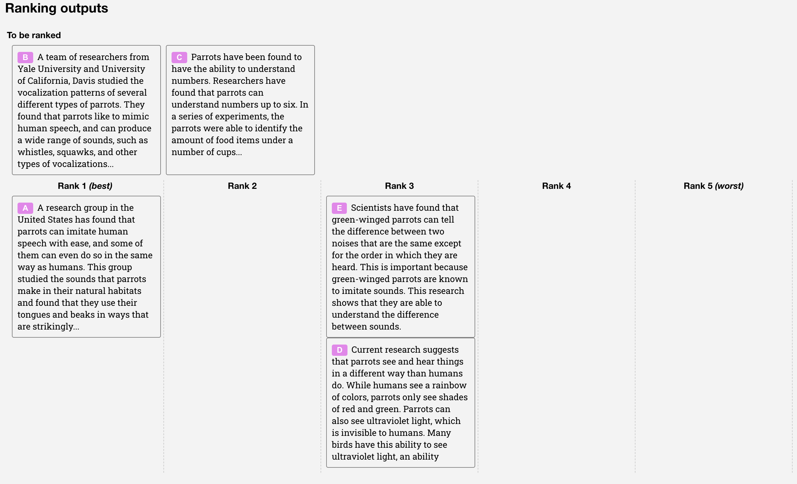
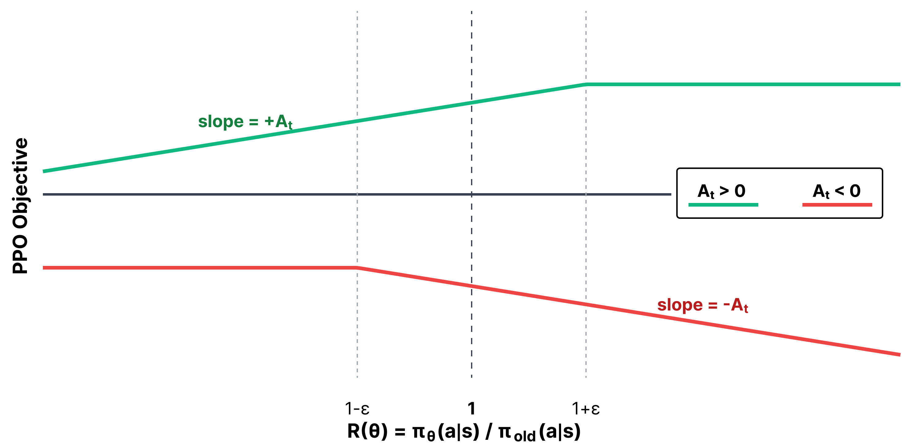
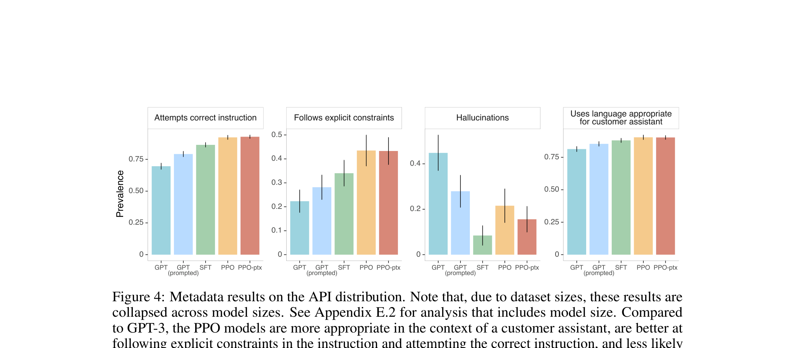

## Plan de la charla

0. **Contexto** — LLM, Transformer, $\pi_\theta$
1. **InstructGPT** — SFT, Bradley-Terry, RM, PPO

# Parte 0

De cero: LLMs y Transformers

## ¿Qué es un LLM?

Un **Large Language Model** parametriza una distribución sobre secuencias de tokens:

$$\pi_\theta(y \mid x), \qquad x = \text{prompt},\; y = \text{respuesta}$$

- $\theta$: miles de millones de pesos (el Transformer)
- Entrenado sobre texto masivo en **pre-entrenamiento**
- Genera texto de forma **autoregresiva**, token a token

## Factorización autoregresiva

Una respuesta $y = (y_1, \ldots, y_T)$ se factoriza:

$$\pi_\theta(y \mid x) = \prod_{t=1}^{T} \pi_\theta(y_t \mid x, y_{<t})$$

**Pre-entrenamiento** = language modeling:

$$\mathcal{L}_{\mathrm{LM}}(\theta) = - \sum_{t=1}^{T} \log \pi_\theta(y_t \mid x, y_{<t})$$

Maximizar likelihood $\Leftrightarrow$ minimizar cross-entropy token a token.

## Factorización autoregresiva

{width=100%}

## ¿Qué es un Transformer?

::: {.columns}
::: {.column width="48%"}
Arquitectura de red neuronal (Vaswani et al., 2017):

- Entrada: embeddings de tokens
- Capas de **self-attention** + FFN
- Salida: logits sobre el vocabulario

$$\pi_\theta(y_t \mid x, y_{<t}) = \mathrm{softmax}\big(f_\theta(x, y_{<t})\big)$$
:::

::: {.column width="52%"}
{width=70%}
:::
:::

## El LLM como policy de RL

| RL | LLM (RLHF) |
|---|---|
| Estado $s_t$ | Contexto $(x, y_{<t})$ |
| Acción $a_t$ | Token $y_t$ |
| Policy $\pi_\theta(a_t \mid s_t)$ | $\pi_\theta(y_t \mid x, y_{<t})$ |
| Trayectoria $\tau$ | Respuesta completa $y$ |
| Episodio | Un prompt → una respuesta |

Log-probabilidad de una respuesta (usada en todo el post-training):

$$\log \pi_\theta(y \mid x) = \sum_{t=1}^{T} \log \pi_\theta(y_t \mid x, y_{<t})$$

## Pre-entrenamiento vs. post-entrenamiento

| | Pre-entrenamiento | Post-entrenamiento |
|---|---|---|
| **Datos** | Texto crudo | Instrucciones, preferencias, verificadores |
| **Objetivo** | $\max \log \pi_\theta(y \mid x)$ | $\max \mathbb{E}[r(x,y)] - \beta D_{\mathrm{KL}}$ |
| **Resultado** | Conocimiento lingüístico | Comportamiento alineado |

Un base model **no** es un asistente: hay que **alinear** $\pi_\theta$ con señales externas.

# Parte 1

InstructGPT · RM + PPO

## Pipeline de 3 etapas

{width=92% fig-align="center"}

::: {.small}
**Fig. 2** — Ouyang et al. (2022): SFT → RM → PPO. **InstructGPT** = **PPO-ptx** (mezcla gradientes de pretraining).
:::

## Las tres etapas

1. **SFT**: entrenamiento supervisado sobre demostraciones humanas $(x, y^\star)$
2. **RM**: entrenamiento sobre rankings de respuestas del modelo ($K \in [4,9]$)
3. **PPO**: entrenamiento por RL sobre el RM

## De dónde salen los datos

**Fuentes de prompts** (dos canales):

1. **Labelers** (~40 contratistas, Upwork + ScaleAI):
2. **API de OpenAI**: prompts reales de clientes

**Tres datasets** derivados de esos prompts:

| Dataset | Contenido | Train (prompts) | Uso |
|---|---|---|---|
| **SFT** | Demostraciones humanas $(x, y^\star)$ | ~13k (11.3k labeler + 1.4k API) | Imitar respuestas ideales |
| **RM** | Rankings de $K$ outputs del modelo ($K \in [4,9]$) | ~33k (6.6k labeler + 26.6k API) | Entrenar $r_\phi$  |
| **PPO** | Solo prompts, sin labels nuevos | ~31k (solo API) | Rollouts en RL |

## De dónde salen los datos

::: {.small}
En RM hay del orden de $K^2$ pares comparados por prompt. Los datasets **no son públicos**.
:::

::: {.columns}
::: {.column width="55%"}
**Fig. 12 (paper)** — interfaz de ranking: labelers ordenan $K$ respuestas del modelo por prompt.
:::
::: {.column width="45%"}
{width=100% .slide-figure-tall}
:::
:::

## Etapa 1 — SFT

Imitar demostraciones humanas $(x, y^\star)$:

$$\mathcal{L}_{\mathrm{SFT}}(\theta) = - \sum_{(x,\, y^\star)} \sum_{t=1}^{|y^\star|} \log \pi_\theta\!\left(y^\star_t \mid x, y^\star_{<t}\right)$$

| | Detalle del paper |
|---|---|
| **Base model** | GPT-3 preentrenado (1.3B, 6B o 175B) |
| **Datos** | ~13k prompts con respuesta escrita por labeler |
| **Épocas** | **16** (val. loss overfittea tras 1; igual eligen checkpoint por **score del RM**, no por loss) |
| **Hiperparámetros** | dropout 0.2, cosine LR → 10%; LR $9.65\times10^{-6}$ (1.3B/6B), $5.03\times10^{-6}$ (175B); batch 32 / 8 |

::: {.callout}
Para **inicializar PPO** usan otra corrida más corta: **2 épocas** SFT + **10%** datos de pretraining mezclados (Appendix C.3). Ese modelo es $\pi_{\mathrm{ref}}$ en la penalización KL.
:::

## Etapa 2 — Modelo de preferencias (Bradley-Terry)

Datos: tuplas $(x, y_w, y_l)$ donde $y_w \succ y_l$ (winner / loser).

Modelo de probabilidad de preferencia:

$$P(y_w \succ y_l \mid x) = \sigma\!\big(r_\phi(x, y_w) - r_\phi(x, y_l)\big), \quad \sigma(z) = \frac{1}{1+e^{-z}}$$

**Loss del Reward Model** (MLE):

$$\mathcal{L}_{\mathrm{RM}}(\phi) = - \mathbb{E}_{(x,y_w,y_l)}\Big[ \log \sigma\!\big(r_\phi(x,y_w) - r_\phi(x,y_l)\big) \Big]$$

## Algunos detalles del RM

| | Detalle del paper |
|---|---|
| **Arquitectura** | **Un solo RM de 6B** para todas las policies (175B RM inestable y caro) |
| **Inicialización** | GPT-3 6B (+ capa escalar en lugar del unembedding); capa SFT removida |
| **Datos** | ~33k prompts; por prompt, $K$ respuestas del SFT/PPO rankeadas → hasta $K^2$ pares |
| **Épocas** | **1** (más épocas → overfit fuerte en val.) |
| **Batch** | 64 prompts × hasta $K^2$ comparaciones (≤ 2 304 pares/batch) |
| **Post-proc.** | Normalizan $r_\phi$ para que demos humanas tengan media 0 antes de RL |

## Como se entrena el RM
{width=95% fig-align="center"}

## Etapa 3 — PPO sobre el RM

Ya conocemos PPO en el contexto del curso. En InstructGPT:

1. Muestrear $x \sim \mathcal{D}$, generar $y \sim \pi_\theta(\cdot \mid x)$
2. Evaluar $r_\phi(x,y)$
3. Actualizar $\theta$ con PPO para maximizar:

$$J(\pi_\theta) = \mathbb{E}_{x,y}\big[r_\phi(x,y)\big] - \beta\, D_{\mathrm{KL}}\!\big(\pi_\theta \,\|\, \pi_{\mathrm{ref}}\big) + \gamma\,\mathbb{E}_{x \sim \mathcal{D}_{\mathrm{pretrain}}}\big[\log \pi_\theta(x)\big]$$

## Etapa 3 — PPO sobre el RM{.smaller}

| | Detalle del paper |
|---|---|
| **Policy** | Inicializada desde SFT 2 ép. + 10% pretrain; tamaños 1.3B / 6B / 175B |
| **RM + critic** | **6B fijos** para todos los tamaños; $V$ inicializado desde el RM |
| **Datos RL** | ~31k prompts únicos → **256k episodios** (bandit: 1 prompt → 1 respuesta → reward) |
| **PPO-ptx** | $\beta = 0.02$ (KL vs. $\pi_{\mathrm{SFT}}$); $\gamma = 27.8$ (mezcla gradientes pretraining) |
| **Entrenamiento** | batch 512, minibatch 64, 1 inner epoch; clip $\varepsilon = 0.2$; temperatura 1 en rollouts |

::: {.columns}
::: {.column width="50%"}
**Policy gradient** (idea central):

$$\nabla_\theta J \propto \mathbb{E}\Big[ \sum_{t=1}^{T} \nabla_\theta \log \pi_\theta(y_t \mid x, y_{<t}) \cdot \hat{A}_t \Big]$$

PPO agrega clipping + critic (GAE) — ya visto en el curso.
:::

::: {.column width="50%"}
{width=100%}
:::
:::

## Resultados de InstructGPT

{width=95% fig-align="center" .slide-figure-wide}

::: {.small}
Preferencia vs. baseline **175B SFT** en prompts de la API. **PPO-ptx 1.3B** supera a **GPT-3 175B**; cada paso del pipeline mejora sobre el anterior (GPT-3 → prompted → SFT → PPO → PPO-ptx).
:::

## Resultados de InstructGPT

{width=100%}

::: {.small}
**Fig. 4 (paper)** — metadata en la distribución API: PPO sigue mejor instrucciones, alucina menos y es más apropiado como asistente.
:::

## Mapeo del curso → InstructGPT

| TAR | InstructGPT |
|---|---|
| $\pi_\theta(a \mid s)$ | $\pi_\theta(y_t \mid x, y_{<t})$ |
| Reward $r$ | $r_\phi(x,y)$ del RM |
| Advantage $\hat{A}_t$ | GAE con critic $V_\phi(s_t)$ |
| Clipping PPO | Mismo $\varepsilon$, ratio $\rho_t = \pi_\theta / \pi_{\theta_{\mathrm{old}}}$ |
| Regularización | KL vs. $\pi_{\mathrm{ref}}$ en el reward |

## Resumen

1. Datos propios: ~13k demos (SFT), ~33k prompts rankeados (RM), ~31k prompts API (PPO)
2. **SFT** 16 ép. (baseline) · init PPO: 2 ép. + 10% pretrain → $\pi_{\mathrm{ref}}$
3. **RM** 6B único, 1 ép., Bradley-Terry sobre $K \in [4,9]$ respuestas por prompt
4. **PPO-ptx**: policy 1.3B–175B, RM/critic 6B, 256k episodios, $\beta=0.02$, $\gamma=27.8$

## Referencias

::: {.small}
- Ouyang et al. (2022). *InstructGPT.* [arXiv:2203.02155](https://arxiv.org/abs/2203.02155)
- Lambert, N. [RLHF Book — curso](https://rlhfbook.com/course)
:::

# ¿Preguntas?

::: {.author-name}
**Lucca Frachelle**
:::

Taller de Aprendizaje por Refuerzo
