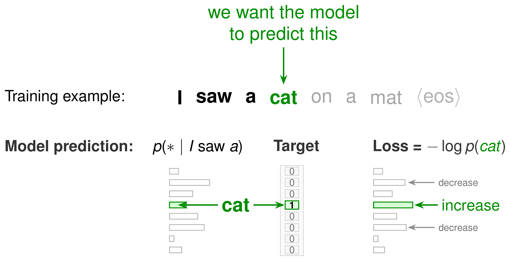
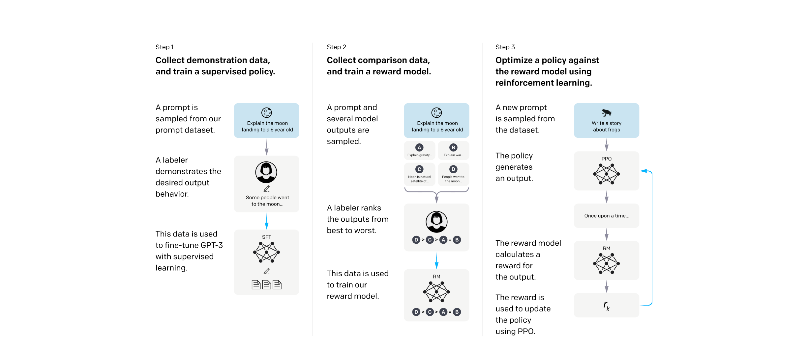
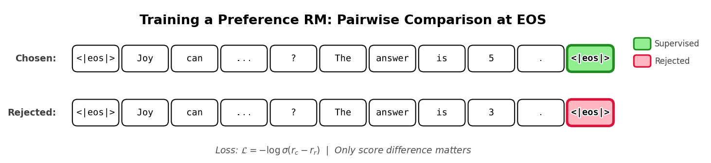

## Plan (~10 min, esperemos!!!)

1. **Pre-entrenamiento** — autoregresión, desalineamiento
2. **SFT** — notación $x$/$y$, imitar demos humanas
3. **RM + PPO** — preferencias y RL (InstructGPT)

# Parte 1

Pre-entrenamiento

## Modelar el lenguaje

**Autoregresión**: predecir el siguiente token dado el contexto.

$$\pi_\theta(w) = \prod_{t=1}^{N} \pi_\theta(w_t \mid w_{<t}), \qquad \mathcal{L}_{\mathrm{LM}} = - \sum_{t=1}^{N} \log \pi_\theta(w_t \mid w_{<t})$$

- Un **Transformer** implementa $\pi_\theta$ (self-attention + softmax sobre el vocabulario)
- Un **LLM** = Transformer grande entrenado sobre texto masivo

## Modelar el lenguaje

{width=85%}

## El modelo está desalineado

Pre-entrenamiento imita el **corpus**, no alinea con lo que queremos de un asistente:

- No sigue instrucciones, puede alucinar o ser tóxico
- **Post-entrenamiento**: SFT → RM → PPO

# Parte 2

SFT

## Notación: prompt $x$ y respuesta $y$

Mismo mecanismo autoregresivo, nueva notación:

- **$x$** — prompt (contexto fijo)
- **$y = (y_1, \ldots, y_T)$** — respuesta generada

$$\pi_\theta(y \mid x) = \prod_{t=1}^{T} \pi_\theta(y_t \mid x, y_{<t})$$

**SFT**: imitar demostraciones humanas $(x, y^\star)$ con la misma loss, solo sobre tokens de $y$:

$$\mathcal{L}_{\mathrm{SFT}}(\theta) = - \sum_{(x, y^\star)} \sum_{t} \log \pi_\theta(y^\star_t \mid x, y^\star_{<t})$$

~13k demos → $\pi^{\mathrm{SFT}}$ (ancla KL en PPO).

# Parte 3

RM + PPO

## El LLM como RL

Generar una respuesta = un **episodio** de decisión secuencial

## Pipeline InstructGPT

{width=90% fig-align="center"}

**SFT** (ya visto) → **RM** (rankings humanos) → **PPO** (optimizar $r_\phi$ con KL vs. $\pi^{\mathrm{SFT}}$)

## Reward Model (Bradley-Terry)

Labelers rankean respuestas: $y_w \succ y_l$ dado $x$.

$$P(y_w \succ y_l \mid x) = \sigma\!\big(r_\phi(x, y_w) - r_\phi(x, y_l)\big)$$

$$\mathcal{L}_{\mathrm{RM}}(\phi) = -\mathbb{E}\Big[\log \sigma\!\big(r_\phi(x, y_w) - r_\phi(x, y_l)\big)\Big]$$

{width=70% fig-align="center"}

## Mapeo completo

| TAR (RL) | LLM / RLHF | Etapa |
|---|---|---|
| Estado $s_t$ | Contexto $(x, y_{<t})$ | — |
| Acción $a_t$ | Token $y_t$ | — |
| Policy $\pi_\theta(a \mid s)$ | $\pi_\theta(y_t \mid x, y_{<t})$ | pre-train, SFT, PPO |
| Trayectoria $\tau$ | Respuesta $y = (y_1, \ldots, y_T)$ | — |
| Episodio | prompt $x$ → respuesta $y$ | rollouts PPO |
| **Reward** $r$ | **$r_\phi(x, y)$** del RM | **PPO maximiza esto** |
| Labels token a token | Demos $(x, y^\star)$, loss NLL | **SFT** → $\pi^{\mathrm{SFT}}$ |
| Preferencias humanas | Rankings $y_w \succ y_l$ | **RM** (Bradley-Terry) |
| Policy gradient + clipping | **PPO** (+ critic GAE) | **PPO-ptx** = InstructGPT |

::: {.small}
**SFT** imita demos fijas; el **RM** puntúa cualquier respuesta; **PPO** usa $r_\phi$ como reward (no hay $y^\star$) y policy gradient para explorar respuestas mejores.
:::

## PPO — Eq. (2)

Muestrear $y \sim \pi^{\mathrm{RL}}(\cdot \mid x)$; maximizar $r_\phi(x,y)$ **sin alejarse** de $\pi^{\mathrm{SFT}}$:

$$\mathbb{E}\Big[r_\phi(x,y) - \beta \log \frac{\pi^{\mathrm{RL}}(y \mid x)}{\pi^{\mathrm{SFT}}(y \mid x)}\Big]$$

**PPO-ptx** (= InstructGPT): suma loss de pre-entrenamiento ($\gamma = 27.8$) para no perder capacidad lingüística (*alignment tax*).

## Resultados

{width=92% fig-align="center" .slide-figure-wide}

**PPO-ptx 1.3B** supera a **GPT-3 175B** en preferencia humana.

## Resumen

1. Pre-entrenamiento: siguiente token → LM desalineado
2. SFT: $(x, y^\star)$ → $\pi^{\mathrm{SFT}}$
3. RM + PPO: optimizar preferencias con ancla KL; PPO-ptx = InstructGPT

## Referencias

::: {.small}
- Ouyang et al. (2022). *InstructGPT.* [arXiv:2203.02155](https://arxiv.org/abs/2203.02155)
:::

# ¿Preguntas?

::: {.author-name}
**Lucca Frachelle**
:::

Taller de Aprendizaje por Refuerzo
