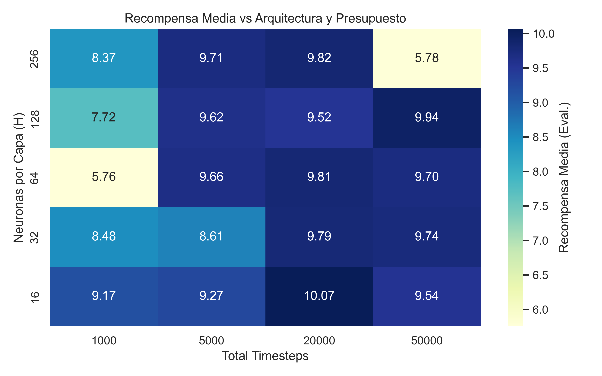
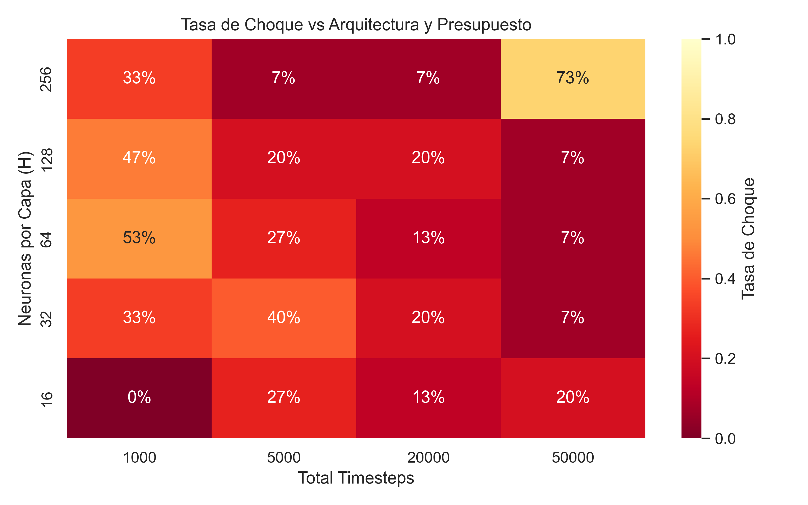
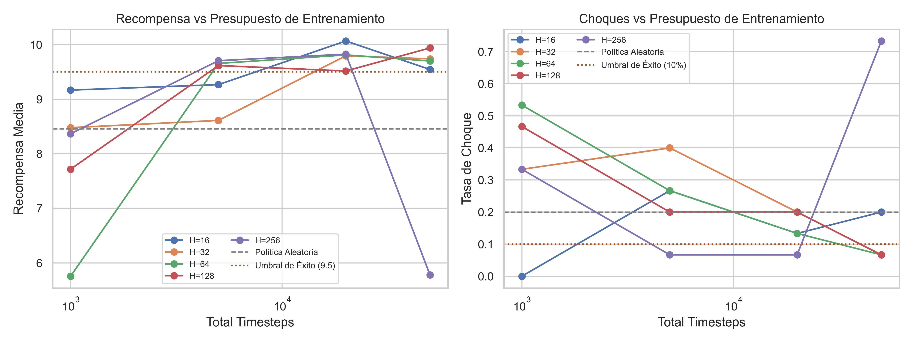
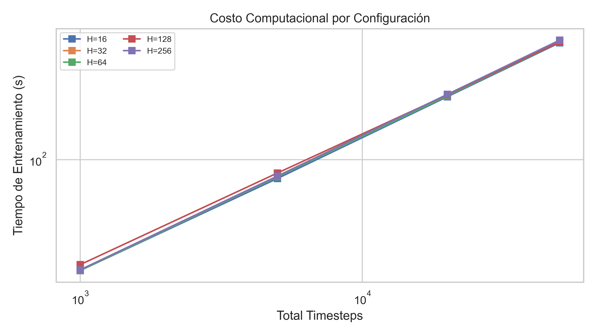

En los laboratorios anteriores implementamos los algoritmos *a mano*: iteración de
valores, Q-learning y, en el Lab 3, un Actor-Critic con REINFORCE y baseline.
Aquí usamos **Proximal Policy Optimization (PPO)** [@schulman2017ppo] mediante la
clase `PPO` de
[`stable-baselines3`](https://stable-baselines3.readthedocs.io), en dos entornos
de distinta naturaleza:

1. **Rotonda (`roundabout-v0`).** Acciones discretas en un entorno de
   [`highway-env`](https://highway-env.farama.org). Familiarización con la API de
   `PPO` y un barrido experimental de arquitectura y presupuesto de entrenamiento
   (Preguntas 1–3).
2. **Dirección asistida (entorno propio).** Un `gym.Env` donde la política corrige
   la deriva de un conductor humano modelado con estados *alerta* / *dormido*
   (Preguntas 8–10).

Las Preguntas 4–7 repasan propiedades teóricas de PPO: divergencia KL entre
políticas gaussianas y forma del *clipped objective*.

::: {.callout-note}
## Reproducibilidad

La **Pregunta 3** se ejecutó por separado (`scripts/`); figuras, tablas y videos
provienen de `results/pregunta3/`. El código fuente está al **final** del
documento (plegable). Las Preguntas 7–10 se ejecutan al compilar.
:::

## Notación y formulación

PPO es un método de **policy gradient** que optimiza una política parametrizada
$\pi_\theta(a\mid s)$ maximizando una estimación del retorno mediante un
**objetivo sustituto recortado** (*clipped surrogate objective*). Sea

$$
r_t(\theta)=\frac{\pi_\theta(a_t\mid s_t)}{\pi_{\theta_{\text{old}}}(a_t\mid s_t)}
$$

el **cociente de probabilidades** (*importance ratio*) entre la política nueva y
la anterior, y $\hat A_t$ una estimación de la **ventaja**
$A(s_t,a_t)=Q(s_t,a_t)-V(s_t)$. En `stable-baselines3` se obtiene mediante
**GAE** (*Generalized Advantage Estimation*) [@schulman2016gae]: a partir del
crítico $V$ y de las recompensas del *rollout*, combina errores TD de varios
pasos con un factor de decaimiento $\lambda$ (`gae_lambda`, $0.95$ por defecto),
interpolando entre un TD de un paso (baja varianza, más sesgo; $\lambda=0$,
como en el Actor-Critic del Lab 3) y una estimación tipo Monte Carlo
($\lambda=1$). Con $\delta_t=r_t+\gamma V(s_{t+1})-V(s_t)$,

$$
\hat A_t=\sum_{l=0}^{\infty}(\gamma\lambda)^l\,\delta_{t+l},
$$

que en la práctica se calcula hacia atrás como
$\hat A_t=\delta_t+\gamma\lambda\,\hat A_{t+1}$. El objetivo de PPO es

$$
L^{\text{CLIP}}(\theta)=\mathbb{E}_t\!\left[
\min\!\Big(r_t(\theta)\,\hat A_t,\;
\operatorname{clip}\!\big(r_t(\theta),\,1-\epsilon,\,1+\epsilon\big)\,\hat A_t\Big)
\right],
$$

donde $\epsilon$ (por defecto $0.2$) acota cuánto puede alejarse la política
nueva de la anterior en una actualización. El recorte cumple el rol de una
**región de confianza** barata: evita pasos de gradiente que cambien demasiado
la política, una de las causas de inestabilidad en los métodos de gradiente
on-policy.

# Parte 1 — PPO en `stable-baselines3`

## Pregunta 1 — El objetivo recortado en el código fuente

Localizamos en `stable-baselines3` la línea donde se define el *clipped
objective* y la reproducimos a continuación.

**Código fuente:** [stable_baselines3/ppo/ppo.py](https://github.com/DLR-RM/stable-baselines3/blob/master/stable_baselines3/ppo/ppo.py)

El objetivo recortado se construye en el método `train()` de la clase `PPO`
(dentro del bucle sobre el *rollout buffer*). Tras normalizar las ventajas y
calcular el cociente de probabilidades, el núcleo es:

```python
# stable_baselines3/ppo/ppo.py — PPO.train()

# ratio between old and new policy, should be one at the first iteration
ratio = th.exp(log_prob - rollout_data.old_log_prob)

# clipped surrogate loss
policy_loss_1 = advantages * ratio
policy_loss_2 = advantages * th.clamp(ratio, 1 - clip_range, 1 + clip_range)
policy_loss = -th.min(policy_loss_1, policy_loss_2).mean()

# ... value loss, entropy loss ...
loss = policy_loss + self.ent_coef * entropy_loss + self.vf_coef * value_loss
```

La correspondencia con la fórmula del *clipped objective* es directa:

- `ratio` $= r_t(\theta)=\exp\!\big(\log\pi_\theta(a_t\mid s_t)-\log\pi_{\theta_{\text{old}}}(a_t\mid s_t)\big)$.
  Se computa en el espacio logarítmico por estabilidad numérica.
- `policy_loss_1` $= r_t(\theta)\,\hat A_t$ (término sin recortar).
- `policy_loss_2` $= \operatorname{clip}(r_t,1-\epsilon,1+\epsilon)\,\hat A_t$,
  con `clip_range` $=\epsilon$ y `th.clamp` implementando el recorte.
- `policy_loss` $= -\mathbb{E}_t[\min(\cdot,\cdot)]$. El signo negativo convierte
  la **maximización** de $L^{\text{CLIP}}$ en una **minimización** de la *loss*,
  que es lo que minimiza Adam por descenso de gradiente.

La *loss* total suma el error del crítico y un término de entropía (última línea
del bloque anterior).


## Pregunta 2 — Estado, acción y recompensa de `roundabout-v0`

**Código fuente:** [highway_env/envs/roundabout_env.py](https://github.com/Farama-Foundation/HighwayEnv/blob/main/highway_env/envs/roundabout_env.py)

Describimos el estado, la acción y la recompensa del entorno `roundabout-v0`,
según `RoundaboutEnv.default_config()` y los métodos `_rewards()` / `_reward()`.

**Estado (observación) — `Kinematics`.** 

La observación es una **matriz**
$V\times F$ con las variables cinemáticas de los vehículos más cercanos; el
**auto controlado** ocupa la primera fila:

- Vehículos $V$: el auto controlado más los demás observados (por defecto $5$
  filas).
- Variables $F$ por vehículo: `["presence", "x", "y", "vx", "vy"]`.
- Coordenadas **absolutas** (`absolute: True`), normalizadas a los rangos
  $x,y\in[-100,100]$ m y $v_x,v_y\in[-15,15]$ m/s.

Es decir, el estado describe *dónde están y a qué velocidad van* los autos del
entorno, no una imagen. Para `MlpPolicy`, esa matriz se aplana en un vector.

**Acción — `DiscreteMetaAction`.** En cada paso de decisión el agente elige **una
sola** meta-acción: el espacio es `Discrete(5)`, no un producto de acciones
laterales y longitudinales. **No se pueden combinar** (p. ej. acelerar *y* cambiar
de carril en el mismo paso): `DiscreteMetaAction.act()` ejecuta exactamente una
de las cinco etiquetas siguientes, y un controlador de bajo nivel traduce esa
orden en maniobras durante el intervalo físico hasta la próxima decisión
(`policy_frequency = 1` Hz → una acción por segundo).

| Índice | Meta-acción | Qué hace en este entorno |
|:---:|:---|:---|
| 0 | `LANE_LEFT` | Maniobra lateral hacia el carril de la izquierda (si existe y es alcanzable). |
| 1 | `IDLE` | Mantener carril y **setpoint de velocidad** actual; el controlador sigue acelerando/frenando hacia ese objetivo. |
| 2 | `LANE_RIGHT` | Maniobra lateral hacia el carril de la derecha (si existe y es alcanzable). |
| 3 | `FASTER` | Subir **un nivel** en la lista discreta de velocidades objetivo. |
| 4 | `SLOWER` | Bajar **un nivel** en esa lista. |

Las velocidades objetivo configuradas son `target_speeds = [0, 8, 16]` m/s. No son
valores continuos: el auto persigue uno de esos tres *setpoints* (índice 0, 1 o 2).
`FASTER` / `SLOWER` incrementan o decrementan ese índice (con recorte en los
extremos). `LANE_LEFT` / `LANE_RIGHT` / `IDLE` delegan en el controlador lateral;
`FASTER` / `SLOWER` solo modifican el setpoint de velocidad y luego el vehículo
sigue la dinámica habitual.

::: {.callout-important}
## Una acción por paso

Si en un paso elegís `FASTER`, **no** cambiáis de carril en ese mismo paso. Para
cambiar carril y subir velocidad hace falta **dos pasos** consecutivos (p. ej.
`LANE_LEFT` y luego `FASTER`). La política de PPO outputea un entero
$a_t \in \{0,1,2,3,4\}$ cada segundo de simulación.
:::

**Recompensa.** Cada paso, `_rewards(action)` devuelve componentes que se
ponderan, se suman y —con `normalize_reward: True`— se reescalan a $[0,1]$ con
`utils.lmap` entre los extremos teóricos $[-1,\,0.2]$; al final se multiplica por
`on_road_reward` (cero si el auto sale de la vía):

$$
r = \underbrace{\text{lmap}\Big(\,\textstyle\sum_i w_i\,c_i\,,\,[-1,\,0.2]\,,\,[0,1]\Big)}_{\text{normalización}}\;\times\;\mathbb{1}[\text{en la vía}].
$$

| Componente | Peso $w_i$ | Valor $c_i$ en el paso | Interpretación |
|---|---|---|---|
| `collision_reward` | $-1$ | $1$ si `crashed`, else $0$ | Penalización fuerte al chocar (episodio termina). |
| `high_speed_reward` | $+0.2$ | $\dfrac{\text{speed\_index}}{K-1}$ con $K=3$ niveles | Bonus por circular en un **setpoint alto** (ver abajo). |
| `lane_change_reward` | $-0.05$ | $1$ si $a_t \in \{0,2\}$, else $0$ | Penalización **en el paso en que elegís** cambiar de carril. |
| `on_road_reward` | (multiplicador) | $1$ si `on_road`, else $0$ | Anula la recompensa si salís de la vía. |

**Velocidad (`high_speed_reward`).** No es la velocidad instantánea $v$ en m/s,
sino el **índice del setpoint discreto** que lleva el vehículo
(`MDPVehicle.get_speed_index`). Con `[0, 8, 16]` m/s:

| `speed_index` | Setpoint (m/s) | $c_i = \text{index}/(K-1)$ | Contribución $w_i c_i$ |
|:---:|:---:|:---:|:---:|
| 0 | 0 | 0.0 | 0 |
| 1 | 8 | 0.5 | $0.2 \times 0.5 = 0.10$ |
| 2 | 16 | 1.0 | $0.2 \times 1.0 = 0.20$ |

Es decir, el entorno **premia mantener el setpoint más alto** (16 m/s): cuanto más
alto el nivel de velocidad objetivo, mayor el término antes de normalizar. Tras
`lmap`, ir a 16 m/s aporta el máximo bonus de velocidad; ir a 0 m/s no aporta.

**Cambio de carril (`lane_change_reward`).** La penalización **no** cuenta cuántas
veces cruzaste líneas en el pasado: depende de la **acción elegida en ese paso**.
Si $a_t = \texttt{LANE\_LEFT}$ o $\texttt{LANE\_RIGHT}$, entonces
$c_i = 1$ y el término es $-0.05$ (antes de normalizar). Si $a_t \in \{\texttt{IDLE},
\texttt{FASTER}, \texttt{SLOWER}\}$, ese término es **cero** aunque el auto siga
desplazándose lateralmente por inercia del controlador. Incentiva maniobras
estables y desalienta zigzaguear con cambios de carril frecuentes.


**No hay recompensa explícita por completar la ruta** (p. ej. salir por el otro
lado). El auto controlado arranca en el acceso sur y tiene destino `nxs` vía
`plan_route_to`, pero eso solo guía el controlador de bajo nivel; la señal de
refuerzo no premia llegar al destino, sino **sobrevivir, mantener setpoint alto
y quedarse en la vía**, con leve penalización por ordenar cambios de carril.

El episodio **termina** (`terminated`) al chocar y se **trunca** (`truncated`) a
los `duration = 11` s.

```python
# highway_env/envs/roundabout_env.py — RoundaboutEnv.default_config() (extracto)

{
    "observation": {
        "type": "Kinematics",
        "absolute": True,
        "features_range": {
            "x": [-100, 100],
            "y": [-100, 100],
            "vx": [-15, 15],
            "vy": [-15, 15],
        },
    },
    "action": {"type": "DiscreteMetaAction", "target_speeds": [0, 8, 16]},
    "collision_reward": -1,
    "high_speed_reward": 0.2,
    "right_lane_reward": 0,
    "lane_change_reward": -0.05,
    "duration": 11,
    "normalize_reward": True,
}

# _rewards() — componentes de la recompensa por paso
def _rewards(self, action: int) -> dict[str, float]:
    return {
        "collision_reward": self.vehicle.crashed,
        "high_speed_reward": MDPVehicle.get_speed_index(self.vehicle)
            / (MDPVehicle.DEFAULT_TARGET_SPEEDS.size - 1),
        "lane_change_reward": action in [0, 2],
        "on_road_reward": self.vehicle.on_road,
    }
```

## Pregunta 3 — Red mínima y cómputo necesario

Buscamos la **red más pequeña** y el **presupuesto de entrenamiento mínimo** que
resuelven `roundabout-v0`. Ejecutamos un barrido completo con
`scripts/lab4_pregunta3_roundabout.py` (métricas, modelos y figuras en
`results/pregunta3/`).

**Configuración de entrenamiento** (igual al enunciado del notebook):

```python
n_cpu = 2
env = make_vec_env("roundabout-v0", n_envs=n_cpu, vec_env_cls=DummyVecEnv)

model = PPO(
    policy="MlpPolicy",
    policy_kwargs=dict(net_arch=[dict(pi=[H, H], vf=[H, H])]),
    env=env, verbose=0, seed=0,
    learning_rate=5e-4, n_steps=64 // n_cpu, n_epochs=10,
    batch_size=64, gamma=0.8, clip_range=0.2,
)
model.learn(total_timesteps=T)
```

**Metodología.** Grid $H\in\{16,32,64,128,256\}$ (dos capas ocultas en actor y
crítico) $\times$ $T\in\{10^3,5\cdot10^3,2\cdot10^4,5\cdot10^4\}$ →
$20$ entrenamientos. Tras cada uno evaluamos la política en $15$ episodios
deterministas (semillas fijas) y registramos recompensa media, tasa de choque,
longitud media del episodio (máximo teórico: $11$ pasos = $11$ s) y tiempo de
entrenamiento.

**Baseline aleatoria** (misma evaluación): recompensa $8.46$, choque $20\%$,
longitud $9.5$ pasos.

**Criterio de éxito:** choque $\le 10\%$, longitud media $\ge 10$ pasos y
recompensa media $> 9.5$. El umbral de recompensa descarta políticas que apenas
sobreviven sin desempeño real — como la de $H=16$, $T=1000$: choque nulo y
longitud $11$, pero recompensa $9.17$ porque el auto **acelera un poco y luego
permanece en `IDLE` dentro de la rotonda**, sin intentar salir.

### Resultados

Las tablas permiten alternar entre el **barrido completo** y la **comparación
vs. aleatoria** (solo diferencias $\Delta$ respecto al baseline).

```{=html}

```

**Cinco** de $20$ configuraciones cumplen el criterio. La red **mínima** que
resuelve es **`[32,32]` con $T=50\,000$**; la más **rápida** en entrenar es
**`[256,256]` con $T=5\,000$** (~76 s, recompensa $9.71$). Datos completos:
`results/pregunta3/results.csv`.

{width=92% fig-alt="Heatmap de recompensa media"}

{width=92% fig-alt="Heatmap de tasa de choque"}

{width=100% fig-alt="Curvas de recompensa y choque vs timesteps"}

{width=92% fig-alt="Tiempo de entrenamiento vs timesteps"}

### Comportamiento visual de los modelos

Grabamos un episodio **determinista** (semilla fija) por configuración en dos
horizontes:

1. **$11$ s** — duración de entrenamiento: aquí el agente acumula recompensa y
   el episodio se trunca en condiciones normales.
2. **$20$ s** — más allá de ese horizonte: permite observar si la política
   **generaliza** (sigue en la vía, sale de la rotonda) o **colapsa** una vez
   que deja de recibir señal útil.

En cada bloque, un botón selecciona el modelo; se muestra un solo video a la vez
(reproductor CSS, sin JavaScript).

#### Horizonte de entrenamiento ($11$ s)

```{=html}

```

#### Generalización ($20$ s)

```{=html}

```

### Análisis

Revisamos los $20$ modelos cruzando **capacidad** ($H$), **presupuesto** ($T$) y
las tres métricas del criterio. Solo **cinco** configuraciones califican; el resto
falla por choque elevado, recompensa baja o ambos.

| $H$ | $T$ | Recompensa | Choque | Longitud | ¿Resuelve? |
|:---:|:---:|:---:|:---:|:---:|:---:|
| 32 | 50 000 | 9.74 | 7% | 11.0 | sí |
| 64 | 50 000 | 9.70 | 7% | 10.8 | sí |
| 128 | 50 000 | **9.94** | 7% | 10.9 | sí (mejor recompensa) |
| 256 | 5 000 | 9.71 | 7% | 11.0 | sí (más rápida: 76 s) |
| 256 | 20 000 | 9.83 | 7% | 10.9 | sí |

**1. Capacidad de la red ($H$).** La observación tiene $25$ entradas y $5$
acciones discretas: el problema es de **baja dimensión**, pero la relación entre
$H$ y desempeño **no es monótona**.

- **$H=16$** nunca resuelve. Con $T=1000$ logra choque **0%** y longitud **11.0**,
  pero recompensa **9.17** (por debajo del umbral). En los videos a $11$ s la
  política **sube levemente el setpoint de velocidad y luego se queda en `IDLE`**
  circulando dentro de la rotonda sin buscar la salida: no choca porque casi no
  interactúa con el tráfico ni ordena cambios de carril (evita la penalización de
  $-0.05$), y acumula algo de bonus de velocidad y recompensa por permanecer en
  la vía — por eso supera al baseline aleatorio ($8.46$) pero **no demuestra
  conducción útil** y queda lejos de $9.5$. Con más entrenamiento el choque
  **empeora** (hasta **27%** en $T=5000$) sin cruzar el piso de recompensa de
  forma estable.
- **$H=32$** necesita el máximo presupuesto ($T=50\,000$) para calificar
  (recompensa **9.74**, choque **7%**). Con $T=20\,000$ ya alcanza **9.79** de
  recompensa pero sigue con choque **20%** — le falta consolidar la política.
- **$H=64$ y $H=128$** muestran el mismo patrón: con poco $T$ colapsan
  ($H=64$, $T=1000$: recompensa **5.76**, choque **53%**; $H=128$, $T=1000$:
  choque **47%**). Solo convergen con $T=50\,000$. Entre las exitosas, **`[128,128]`**
  obtiene la **mayor recompensa** (**9.94**).
- **$H=256$** es el caso más contrastante. Con $T=5\,000$ o $T=20\,000$ **resuelve**
  en ~76 s y ~304 s respectivamente, pero con $T=50\,000$ **colapsa**: recompensa
  **5.78**, choque **73%** — el **peor** resultado del barrido, peor que la
  política aleatoria (**20%**). No podemos afirmar *overfitting* clásico (no hay
  conjunto de validación separado ni curvas de entrenamiento vs. evaluación), pero
  **hay sospechas razonables de sobre-entrenamiento o inestabilidad de PPO**:
  la red más grande del barrido, con muchos *updates* sobre el mismo entorno
  (`n_envs=2`, semilla única), pasa de políticas estables ($T=5\,000$/$20\,000$:
  choque **7%**) a una conducta agresiva e inestable ($T=50\,000$). Ese patrón
  en **U invertida** encaja con memorizar idiosincrasias del roll-out de
  entrenamiento o con deriva del optimizador on-policy, más que con “más $T$
  siempre mejora”.

En conjunto: redes **pequeñas** ($H=16$) pueden parecer seguras pero no alcanzan
recompensa; redes **medianas** requieren mucho $T$; la red **grande** del enunciado
funciona bien solo en un **rango intermedio** de $T$, no con “más entrenamiento
siempre es mejor”.

**2. Presupuesto de entrenamiento ($T$).** Para cada $H$, aumentar $T$ no mejora
de forma uniforme:

- **$H=16$:** de $T=1000$ a $T=5000$ el choque pasa de **0%** a **27%** pese a
  más interacción; la recompensa oscila sin superar **9.54** en $T=50\,000$.
- **$H=32$:** mejora monótona en recompensa (**8.48 → 9.74**), pero el choque solo
  baja del **40%** al **7%** en el último salto ($T=20\,000 \to 50\,000$).
- **$H=64$:** choque **53% → 27% → 13% → 7%** al aumentar $T$; la recompensa
  cruza el umbral recién en $T=50\,000$.
- **$H=128$:** recompensa alta ya en $T=5\,000$ (**9.62**), pero choque **20%**
  hasta $T=50\,000$; ilustra que **buena recompensa no implica éxito** si el
  choque sigue alto.
- **$H=256$:** curva en **U invertida** — óptimo en $T\in\{5000,20000\}$, peor
  en $T=1000$ (choque **33%**) y catastrófico en $T=50\,000$.

Este comportamiento encaja con $\gamma=0.8$ (horizonte efectivo corto), semilla
única y solo $2$ entornos paralelos: políticas que aprenden “rápido” con red grande
($H=256$, $T=5000$) pueden ser suficientes; seguir entrenando no garantiza
refinamiento y, en el peor caso, **degrada** el desempeño.

**3. Costo computacional.** El tiempo escala **linealmente** con $T$
(≈15 ms/paso), casi independiente de $H$ ($T=5000$ ≈ 75 s para cualquier $H$).
El cuello de botella es la **simulación**, no el *forward pass*. Trade-off claro:

- **Más barato que resuelve:** `[256,256]` + $T=5\,000$ (**76 s**).
- **Red más chica que resuelve:** `[32,32]` + $T=50\,000$ (**741 s**, ~12 min).
- **Mejor recompensa entre exitosas:** `[128,128]` + $T=50\,000$ (**743 s**).

**4. Por qué exigimos recompensa $> 9.5$.** La recompensa normalizada puede
engañar. Ejemplos del barrido:

- $H=16$, $T=20\,000$: recompensa **10.07**, choque **13%** — alta recompensa con
  colisiones frecuentes.
- $H=128$, $T=5\,000$: recompensa **9.62**, choque **20%** — cerca del umbral en
  recompensa pero lejos en seguridad.
- $H=16$, $T=1\,000$: choque **0%**, recompensa **9.17** — segura pero pasiva
  (aceleración breve + `IDLE` en la rotonda; ver videos a $11$ s).

Por eso el criterio combina choque, longitud **y** recompensa.

**5. Entrenamiento vs. generalización (videos).** Los bloques a **11 s** y **20 s**
complementan la tabla: una política puede cumplir métricas en evaluación a $11$ s
y **desorganizarse** al extender la simulación — sobre todo en
configuraciones con choque marginal o en $H=256$ con $T$ mal elegido. Comparar
ambos bloques ayuda a separar “evita choques dentro del horizonte de recompensa”
de “mantiene una trayectoria coherente al salir de la rotonda”.


# Parte 2 — Propiedades teóricas de PPO

## Pregunta 4 — Divergencia KL entre políticas gaussianas

Demostramos que si $\pi_\theta(A\mid S)$ y $\pi_\omega(A\mid S)$ son políticas
gaussianas con la misma desviación estándar $\sigma$ y medias $\mu_\theta(s)$ y
$\mu_\omega(s)$, entonces
$D_{KL}(\pi_\theta\,\|\,\pi_\omega)\propto(\mu_\theta-\mu_\omega)^2$.

Para un estado fijo $S$, ambas políticas son densidades normales sobre la acción
$a\in\mathbb{R}$ con la misma varianza $\sigma^2$:

$$
\pi_\theta(a\mid S)=\frac{1}{\sqrt{2\pi}\,\sigma}\exp\!\left(-\frac{(a-\mu_\theta)^2}{2\sigma^2}\right),
\qquad
\pi_\omega(a\mid S)=\frac{1}{\sqrt{2\pi}\,\sigma}\exp\!\left(-\frac{(a-\mu_\omega)^2}{2\sigma^2}\right),
$$

donde escribimos $\mu_\theta=\mu_\theta(S)$ y $\mu_\omega=\mu_\omega(S)$. Por
definición,

$$
D_{KL}(\pi_\theta\,\|\,\pi_\omega)
=\mathbb{E}_{a\sim\pi_\theta}\!\left[\log\frac{\pi_\theta(a\mid S)}{\pi_\omega(a\mid S)}\right].
$$

Como los factores de normalización $1/(\sqrt{2\pi}\,\sigma)$ son **idénticos**,
se cancelan dentro del logaritmo, y queda solo la diferencia de exponentes:

$$
\log\frac{\pi_\theta(a\mid S)}{\pi_\omega(a\mid S)}
=-\frac{(a-\mu_\theta)^2}{2\sigma^2}+\frac{(a-\mu_\omega)^2}{2\sigma^2}
=\frac{(a-\mu_\omega)^2-(a-\mu_\theta)^2}{2\sigma^2}.
$$

Desarrollamos la diferencia de cuadrados:

$$
(a-\mu_\omega)^2-(a-\mu_\theta)^2
=\big[(a-\mu_\omega)-(a-\mu_\theta)\big]\big[(a-\mu_\omega)+(a-\mu_\theta)\big]
=(\mu_\theta-\mu_\omega)\,(2a-\mu_\theta-\mu_\omega).
$$

Por lo tanto,

$$
\log\frac{\pi_\theta}{\pi_\omega}
=\frac{(\mu_\theta-\mu_\omega)\,(2a-\mu_\theta-\mu_\omega)}{2\sigma^2}.
$$

Tomamos esperanza bajo $a\sim\pi_\theta$, donde $\mathbb{E}_{\pi_\theta}[a]=\mu_\theta$:

$$
\mathbb{E}_{\pi_\theta}\!\left[2a-\mu_\theta-\mu_\omega\right]
=2\mu_\theta-\mu_\theta-\mu_\omega=\mu_\theta-\mu_\omega.
$$

Sustituyendo,

$$
\boxed{\;D_{KL}(\pi_\theta\,\|\,\pi_\omega)
=\frac{(\mu_\theta-\mu_\omega)\,(\mu_\theta-\mu_\omega)}{2\sigma^2}
=\frac{(\mu_\theta-\mu_\omega)^2}{2\sigma^2}\;}
$$

La KL depende **solo del cuadrado de la diferencia de medias**,
$D_{KL}\propto(\mu_\theta-\mu_\omega)^2$, con constante de proporcionalidad
$1/(2\sigma^2)$. La identidad del enunciado
$D_{KL}=(\mu_\theta-\mu_\omega)^2$ corresponde al caso particular
$\sigma^2=\tfrac12$ (o, equivalentemente, a omitir la constante). $\blacksquare$

Con varianza fija, controlar la distancia entre medias equivale a controlar la
KL; es la motivación de las regiones de confianza en TRPO/PPO.

Para las siguientes preguntas, recordamos el *clipped objective* como función del
cociente $r$ y la ventaja $A$:

$$
L(r,A)=\min\!\big(r\,A,\;\operatorname{clip}_\epsilon(r)\,A\big),
\qquad
\operatorname{clip}_\epsilon(r)=
\begin{cases}
1-\epsilon & r<1-\epsilon,\\
r & 1-\epsilon\le r\le 1+\epsilon,\\
1+\epsilon & r>1+\epsilon.
\end{cases}
$$

## Pregunta 5 — Forma de $L(r,A)$ para $A>0$

Demostramos que $L(r,A)=A\,\min(r,\,1+\epsilon)$ cuando $A>0$. Como $A>0$, el
factor $A$ es positivo y **preserva** el orden, de modo que se
puede sacar del mínimo:

$$
L(r,A)=\min(r\,A,\;\operatorname{clip}_\epsilon(r)\,A)
=A\,\min\!\big(r,\;\operatorname{clip}_\epsilon(r)\big).
$$

Basta entonces probar que $\min(r,\operatorname{clip}_\epsilon(r))=\min(r,1+\epsilon)$,
analizando los tres tramos del recorte:

- **$r<1-\epsilon$:** $\operatorname{clip}_\epsilon(r)=1-\epsilon$. Como
  $r<1-\epsilon<1+\epsilon$, se tiene $\min(r,1-\epsilon)=r$ y también
  $\min(r,1+\epsilon)=r$. Coinciden.
- **$1-\epsilon\le r\le 1+\epsilon$:** $\operatorname{clip}_\epsilon(r)=r$, luego
  $\min(r,r)=r$; y como $r\le 1+\epsilon$, $\min(r,1+\epsilon)=r$. Coinciden.
- **$r>1+\epsilon$:** $\operatorname{clip}_\epsilon(r)=1+\epsilon$, luego
  $\min(r,1+\epsilon)=1+\epsilon$; e igualmente $\min(r,1+\epsilon)=1+\epsilon$.
  Coinciden.

En los tres casos $\min(r,\operatorname{clip}_\epsilon(r))=\min(r,1+\epsilon)$, de
donde

$$
\boxed{\;L(r,A)=A\,\min(r,\,1+\epsilon)\quad\text{para }A>0.\;}
$$

**Lectura.** Con ventaja positiva queremos **aumentar** $r$ (subir la
probabilidad de la acción buena), pero la recompensa del objetivo se **satura**
en $r=1+\epsilon$: pasado ese punto, aumentar más $r$ no aporta, lo que elimina
el incentivo a dar pasos enormes. $\blacksquare$

## Pregunta 6 — Forma de $L(r,A)$ para $A<0$

Demostramos que $L(r,A)=|A|\,\min(-r,\,-(1-\epsilon))$ cuando $A<0$. Como
$A<0$, multiplicar por un número negativo **invierte** el orden, así que
el mínimo de los productos se vuelve el máximo de los factores:

$$
L(r,A)=\min(r\,A,\;\operatorname{clip}_\epsilon(r)\,A)
=A\,\max\!\big(r,\;\operatorname{clip}_\epsilon(r)\big).
$$

Veamos que $\max(r,\operatorname{clip}_\epsilon(r))=\max(r,1-\epsilon)$:

- **$r<1-\epsilon$:** $\operatorname{clip}_\epsilon(r)=1-\epsilon$, y
  $\max(r,1-\epsilon)=1-\epsilon$ (pues $r<1-\epsilon$). Igual a $\max(r,1-\epsilon)$.
- **$1-\epsilon\le r\le 1+\epsilon$:** $\operatorname{clip}_\epsilon(r)=r$, y
  $\max(r,r)=r$; como $r\ge 1-\epsilon$, $\max(r,1-\epsilon)=r$. Coinciden.
- **$r>1+\epsilon$:** $\operatorname{clip}_\epsilon(r)=1+\epsilon$, y
  $\max(r,1+\epsilon)=r$; como $r>1-\epsilon$, $\max(r,1-\epsilon)=r$. Coinciden.

Luego $L(r,A)=A\,\max(r,1-\epsilon)$. Para llegar a la forma del enunciado,
escribimos $A=-|A|$ y usamos $\max(x,y)=-\min(-x,-y)$:

$$
L(r,A)=-|A|\,\max(r,1-\epsilon)
=-|A|\,\big(-\min(-r,-(1-\epsilon))\big)
=|A|\,\min\!\big(-r,\,-(1-\epsilon)\big).
$$

$$
\boxed{\;L(r,A)=|A|\,\min\!\big(-r,\,-(1-\epsilon)\big)\quad\text{para }A<0.\;}
$$

**Lectura.** Con ventaja negativa queremos **disminuir** $r$ (bajar la
probabilidad de la acción mala). El objetivo se satura en $r=1-\epsilon$: por
debajo de ese umbral, seguir reduciendo $r$ no mejora el objetivo, evitando otra
vez actualizaciones excesivas. $\blacksquare$

## Pregunta 7 — Gráfico de $L(r,A)$ y efecto de $\epsilon$

Graficamos $L(r,A)$ para $A>0$ y $A<0$ y comentamos el efecto del parámetro
$\epsilon$.

```{python}
#| label: setup-plot
import numpy as np
import matplotlib as mpl
import matplotlib.pyplot as plt
import seaborn as sns

sns.set_theme(style="whitegrid", context="notebook", palette="deep")
mpl.rcParams.update({
    "figure.dpi": 400,
    "savefig.dpi": 400,
    "figure.constrained_layout.use": True,
    "axes.titlesize": 12,
    "axes.labelsize": 11,
    "legend.fontsize": 9,
    "xtick.labelsize": 9,
    "ytick.labelsize": 9,
    "axes.spines.top": False,
    "axes.spines.right": False,
    "axes.grid": True,
    "grid.alpha": 0.3,
    "lines.linewidth": 1.8,
    "mathtext.fontset": "cm",
})
PALETTE = sns.color_palette("deep")
FIG_DPI = 400


def clip_eps(r, eps):
    return np.clip(r, 1 - eps, 1 + eps)


def L(r, A, eps):
    return np.minimum(r * A, clip_eps(r, eps) * A)


def _style_2d_ax(ax, xlabel, ylabel, title):
    ax.set_xlabel(xlabel)
    ax.set_ylabel(ylabel)
    ax.set_title(title, fontsize=11, pad=10)
    ax.grid(True, which="major", color="#cccccc", linewidth=0.9, alpha=1.0)
    ax.set_axisbelow(True)
```

```{python}
#| label: fig-clip-objective
#| fig-cap: "Objetivo recortado $L(r,A)$ como función del cociente $r$, para ventaja positiva ($A=1$) y negativa ($A=-1$), con $\\epsilon=0.2$. Las zonas sombreadas marcan donde el recorte aplana el objetivo."

r = np.linspace(0.0, 2.0, 600)
eps = 0.2

fig, axes = plt.subplots(1, 2, figsize=(11, 4.5), dpi=FIG_DPI)

# --- A > 0 ---
ax = axes[0]
ax.plot(r, L(r, 1.0, eps), color=PALETTE[0], label=r"$L(r,A)=A\,\min(r,1+\epsilon)$")
ax.plot(r, r * 1.0, color="grey", ls="--", lw=1.3, label=r"$rA$ (sin recortar)")
ax.axvline(1 - eps, color=PALETTE[3], ls=":", lw=1.2)
ax.axvline(1 + eps, color=PALETTE[3], ls=":", lw=1.2)
ax.axvspan(1 + eps, 2.0, color=PALETTE[1], alpha=0.12)
_style_2d_ax(
    ax,
    xlabel=r"$r=\pi_\theta/\pi_{\theta_{\text{old}}}$",
    ylabel=r"$L(r,A)$",
    title=r"Ventaja Positiva $A>0$",
)
ax.annotate(r"saturación en $r=1+\epsilon$", xy=(1 + eps, 1 + eps),
            xytext=(1.25, 0.7), fontsize=8,
            arrowprops=dict(arrowstyle="->", color="grey"))
ax.legend(loc="upper left", framealpha=0.95)

# --- A < 0 ---
ax = axes[1]
ax.plot(r, L(r, -1.0, eps), color=PALETTE[2], label=r"$L(r,A)=|A|\,\min(-r,-(1-\epsilon))$")
ax.plot(r, r * (-1.0), color="grey", ls="--", lw=1.3, label=r"$rA$ (sin recortar)")
ax.axvline(1 - eps, color=PALETTE[3], ls=":", lw=1.2)
ax.axvline(1 + eps, color=PALETTE[3], ls=":", lw=1.2)
ax.axvspan(0.0, 1 - eps, color=PALETTE[1], alpha=0.12)
_style_2d_ax(
    ax,
    xlabel=r"$r=\pi_\theta/\pi_{\theta_{\text{old}}}$",
    ylabel=r"$L(r,A)$",
    title=r"Ventaja Negativa $A<0$",
)
ax.annotate(r"saturación en $r=1-\epsilon$", xy=(1 - eps, -(1 - eps)),
            xytext=(0.05, -1.35), fontsize=8,
            arrowprops=dict(arrowstyle="->", color="grey"))
ax.legend(loc="upper right", framealpha=0.95)

plt.show()
```

La línea punteada gris es el objetivo **sin recortar** $rA$; la curva de color es
$L(r,A)$. Las líneas de puntos verticales marcan $r=1-\epsilon$ y $r=1+\epsilon$.

- **$A>0$ (panel izquierdo).** $L$ crece con $r$ hasta $r=1+\epsilon$ y allí se
  **aplana**: una vez que la nueva política ya hizo la acción buena
  suficientemente más probable, el objetivo deja de premiar más. El gradiente se
  anula en la zona sombreada, así que no hay incentivo a dar pasos grandes.
- **$A<0$ (panel derecho).** $L$ decrece (su valor sube hacia $0$ a medida que
  $r\to 0$) hasta $r=1-\epsilon$ y allí se **aplana**: una vez que la acción mala
  se hizo bastante menos probable, el objetivo deja de empujar.

**Efecto de $\epsilon$.** El parámetro define el ancho de la **región de
confianza** $[1-\epsilon,\,1+\epsilon]$ donde el objetivo coincide con $rA$:

- $\epsilon$ **chico** ⇒ banda angosta ⇒ la política se actualiza poco por paso
  (más estable, más lento).
- $\epsilon$ **grande** ⇒ banda ancha ⇒ pasos más agresivos (más rápido, pero con
  riesgo de inestabilidad).

```{python}
#| label: fig-clip-eps
#| fig-cap: "Efecto de $\\epsilon$ sobre $L(r,A)$ con $A>0$: a mayor $\\epsilon$, más tarde satura el objetivo (banda de confianza más ancha)."

fig, ax = plt.subplots(figsize=(7.5, 4.2), dpi=FIG_DPI)
for eps, col in zip([0.1, 0.2, 0.4], [PALETTE[0], PALETTE[2], PALETTE[4]]):
    ax.plot(r, L(r, 1.0, eps), color=col, label=rf"$\epsilon={eps}$")
ax.plot(r, r, color="grey", ls="--", lw=1.2, label=r"$rA$ (sin recortar)")
_style_2d_ax(
    ax,
    xlabel=r"$r=\pi_\theta/\pi_{\theta_{\text{old}}}$",
    ylabel=r"$L(r,A)$",
    title=r"Saturación del Objetivo según $\epsilon$  ($A>0$)",
)
ax.legend(loc="upper left", framealpha=0.95)
plt.show()
```

# Parte 3 — Entorno propio: lane keeping asistido

Imaginemos un auto en un carril recto. Queremos que un **sistema automático**
ayude al conductor a **no salirse del centro** ($x=0$), pero sin pelear con él
cuando conduce bien. El conductor puede estar **alerta** (corrige con un
controlador tipo PI) o **dormido** (deja de corregir y el auto **deriva** al
azar). La red de PPO no reemplaza al humano: solo aporta una **corrección extra**
de dirección que se **suma** a la del conductor.

En cada instante ocurre lo siguiente:

| ¿Qué? | Significado (sin código) |
|:---|:---|
| **Estado** (lo que ve la red) | Posición lateral $x$ (¿dónde está en el carril?), velocidad lateral $v$ (¿hacia dónde se mueve?) y una bandera **alerta/dormido** (¿el humano está activo?). |
| **Acción** (lo que decide la red) | Un número en $[-1,1]$: cuánto girar el volante **extra** (`policy_steering`). Positivo = empujar a la derecha; negativo = a la izquierda; cerca de 0 = casi no intervenir. |
| **Acción humana** | Si está alerta, un control PI empuja hacia el centro; si está dormido, solo ruido aleatorio (deriva). |
| **Dirección final** | `assisted_steering` = corrección de la red **+** acción humana. Eso acelera o frena el movimiento lateral del auto. |
| **Recompensa** | Premia estar cerca del centro ($-e^2$) y penaliza usar mucha asistencia ($-0.05\,u^2$): corregir solo lo necesario. |
| **Fin del episodio** | Si $|x|>10$, el auto “salió del carril” y termina. |

La **idea general**: aprender un copiloto que **compense la deriva** cuando el
humano duerme, pero que **no sobre-corrija** cuando el humano ya va bien —
gracias al término de consumo en la recompensa.

## Pregunta 8 — Dinámica del sistema y recompensa

Completamos las líneas que faltaban en `step()`: integrar posición y velocidad
(Euler) y calcular la recompensa del enunciado
$\text{reward}=-e^2-0.05\,u^2$.

- **`self.v += acc * self.dt`:** la velocidad lateral cambia según la aceleración
  (dirección asistida menos amortiguamiento).
- **`self.x += self.v * self.dt`:** la posición lateral avanza según la velocidad
  (actualizada justo antes).
- **`reward = -e**2 - 0.05 * u**2`:** cuanto más lejos del centro ($e$), peor;
  cuanto más gira la red ($u$), peor — incentiva intervenciones **suaves**.

El código completo del entorno está plegado abajo; al desplegarlo podés seguir
cada función con los comentarios inline.

```{python}
#| label: lane-keeping-env
#| code-fold: true
#| code-summary: "Código del entorno LaneKeepingEnv"
import gymnasium as gym
from gymnasium import spaces
import numpy as np


class LaneKeepingEnv(gym.Env):
    """
    Control lateral de un vehículo con:
    - controlador PI en modo ALERTA
    - deriva aleatoria en modo DORMIDO
    La política de RL aporta `policy_steering`, que se suma a la acción humana.
    """

    def __init__(self):
        super().__init__()

        # Estado: [posición lateral x, velocidad lateral v, alerta]
        self.observation_space = spaces.Box(
            low=np.array([-10.0, -10.0, 0]),
            high=np.array([10.0, 10.0, 1]),
            dtype=np.float32,
        )
        # Acción: corrección de dirección de la política, en [-1, 1]
        self.action_space = spaces.Box(
            low=-1.0, high=1.0, shape=(1,), dtype=np.float32
        )

        # Dinámica
        self.dt = 0.1
        self.x = 0.0
        self.v = 0.0
        self.alerta = 1  # 1 = ALERTA, 0 = DORMIDO

        # Controlador PI del humano
        self.Kp = 0.8
        self.Ki = 0.1
        self.integral = 0.0

        self.target = 0.0  # centro del carril

    def reset(self, seed=None, options=None):
        super().reset(seed=seed)
        self.x = np.random.uniform(-2, 2)
        self.v = 0.0
        self.alerta = np.random.choice([0, 1], p=[0.3, 0.7])
        self.integral = 0.0
        return self._get_obs(), {}

    def control_humano(self):
        error = self.target - self.x
        self.integral += error * self.dt
        if self.alerta == 1:
            # Conductor alerta: controlador proporcional-integral
            human_steering = self.Kp * error + self.Ki * self.integral
            human_steering = np.clip(human_steering, -2, 2)
        else:
            # Conductor dormido: deriva aleatoria
            human_steering = np.random.normal(0, 0.6)
        return human_steering

    def _get_obs(self):
        return np.array([self.x, self.v, self.alerta], dtype=np.float32)

    def step(self, action):
        policy_steering = float(np.clip(action[0], -1, 1))
        human_steering = self.control_humano()
        assisted_steering = policy_steering + human_steering
        amortiguamiento = 0.2 * self.v

        # --- DINÁMICA DEL SISTEMA ---
        acc = assisted_steering - amortiguamiento
        self.v += acc * self.dt           # v(t+1) = v(t) + acc(t) dt
        self.x += self.v * self.dt        # x(t+1) = x(t) + v(t+1) dt

        # recompensa: centrado en el carril (e) y consumo de la asistencia (u)
        e = self.target - self.x
        u = policy_steering
        reward = -e**2 - 0.05 * u**2

        # penalizar salirse del carril
        terminated = abs(self.x) > 10
        truncated = False

        return self._get_obs(), reward, terminated, truncated, {}
```

## Pregunta 9 — Entrenamiento de la política asistida

Entrenamos la red con **PPO** durante $50\,000$ pasos de simulación. En cada
paso la red observa $(x, v, \text{alerta})$, elige una corrección de dirección
continua y recibe la recompensa del entorno. Tras muchos episodios debería
aprender **cuándo** intervenir fuerte (humano dormido, $x$ se aleja) y **cuándo**
casi no tocar el volante (humano alerta y ya corrige solo).

Parámetros del enunciado: `MlpPolicy`, `n_steps=256`, `batch_size=64`,
$\gamma=0.99$, `learning_rate=3e-4`. La acción es continua, así que SB3 usa una
política **gaussiana** (la misma familia de la Pregunta 4).

```{python}
#| label: train-ppo-lane
#| code-fold: true
#| code-summary: "Entrenamiento PPO (lane keeping)"
from stable_baselines3 import PPO
from stable_baselines3.common.env_util import make_vec_env

env = make_vec_env(lambda: LaneKeepingEnv(), n_envs=1)

model = PPO(
    "MlpPolicy",
    env,
    verbose=0,
    n_steps=256,
    batch_size=64,
    gamma=0.99,
    learning_rate=3e-4,
    seed=0,
)

model.learn(total_timesteps=50_000)
print("Entrenamiento finalizado:", model.num_timesteps, "timesteps.")
```

## Pregunta 10 — Visualización de los resultados

Simulamos **300 pasos** con la política ya entrenada (sin exploración aleatoria:
`deterministic=True`). En el gráfico:

- la **curva azul** es la posición lateral $x$ en el tiempo;
- la **línea punteada** en $x=0$ es el centro del carril;
- las **bandas sombreadas** marcan intervalos en que el conductor estuvo
  **dormido** — ahí debería notarse más la acción del copiloto.

```{python}
#| label: rollout-lane
#| code-fold: true
#| code-summary: "Simulación y métricas (300 pasos)"
obs = env.reset()

positions, rewards, alertas = [], [], []
for _ in range(300):
    action, _ = model.predict(obs, deterministic=True)
    obs, reward, done, info = env.step(action)
    positions.append(float(obs[0][0]))
    rewards.append(float(reward[0]))
    alertas.append(float(obs[0][2]))
    if done:
        break

positions = np.array(positions)
alertas = np.array(alertas)
mae = np.mean(np.abs(positions[-100:]))
print(f"Pasos simulados: {len(positions)} | "
      f"error absoluto medio (últimos 100 pasos): {mae:.3f}")
```

```{python}
#| label: fig-lane-keeping
#| fig-cap: "Posición lateral $x$ bajo la política asistida entrenada. La línea punteada marca el centro del carril ($x=0$); las bandas sombreadas indican tramos en que el conductor estuvo *dormido*."

fig, ax = plt.subplots(figsize=(9, 4.2), dpi=FIG_DPI)
t = np.arange(len(positions))
ax.plot(t, positions, color=PALETTE[0], lw=1.8, label=r"posición lateral $x$")
ax.axhline(0, color="grey", ls="--", lw=1.2, label="centro del carril")

dormido = alertas < 0.5
ymin, ymax = positions.min() - 0.3, positions.max() + 0.3
ax.fill_between(t, ymin, ymax, where=dormido,
                color=PALETTE[3], alpha=0.12, step="mid",
                label="conductor dormido")

_style_2d_ax(
    ax,
    xlabel="Paso temporal",
    ylabel=r"$x$",
    title="Lane keeping asistido (posición lateral)",
)
ax.set_ylim(ymin, ymax)
ax.legend(loc="upper right", framealpha=0.95)
plt.show()
```

La política aprende a **cancelar la deriva** del conductor: $x$ permanece cerca
de $0$ incluso en las bandas “dormido”. Cuando el humano está alerta, la red
interviene poco (el término $-0.05\,u^2$ castiga correcciones grandes) y deja
actuar al PI humano.

# Conclusión {.unnumbered}

Este laboratorio cierra el recorrido del curso: de implementar algoritmos a mano
a usar una librería de producción. PPO combina un **objetivo recortado** —región
de confianza barata (Preguntas 1, 5–7)— con el vínculo entre **KL** y diferencia
de medias en políticas gaussianas (Pregunta 4). En `roundabout-v0`, el barrido de
la Pregunta 3 muestra que la solución más económica es `[256,256]` con
$T=5000$, mientras arquitecturas mal calibradas pueden empeorar el desempeño; la
comparación de videos a $11$ s y $20$ s separa desempeño dentro del horizonte de
recompensa de la generalización posterior. Por último, un `gym.Env` propio de
*lane keeping* confirma que la misma clase `PPO` aprende asistencia parsimoniosa
frente a un conductor con estados alerta/dormido (Preguntas 8–10).

# Apéndice — Código auxiliar (Pregunta 3) {.unnumbered}

Scripts en `labs/lab4/scripts/` (no se ejecutan al compilar). Desde
`labs/lab4/`:

<details>
<summary><strong>Comandos para reproducir</strong></summary>

```bash
python scripts/lab4_pregunta3_roundabout.py           # barrido (~95 min)
python scripts/lab4_pregunta3_roundabout.py --resume
python scripts/lab4_pregunta3_videos.py --skip-existing
python scripts/lab4_pregunta3_tables.py
```

</details>

## `lab4_pregunta3_roundabout.py`

Barrido de arquitectura ($H$) y presupuesto ($T$): entrena PPO, evalúa cada
combinación y guarda modelos, CSV/JSON y figuras en `results/pregunta3/`.

<details>
<summary><strong>lab4_pregunta3_roundabout.py</strong> — clic para ver el código</summary>

```{.python}

```

</details>

## `lab4_pregunta3_videos.py`

Graba un episodio determinista por modelo a **11 s** y **20 s**, codifica los
mp4 en base64 y genera los fragmentos HTML embebidos en la Pregunta 3.

<details>
<summary><strong>lab4_pregunta3_videos.py</strong> — clic para ver el código</summary>

```{.python}

```

</details>

## `lab4_pregunta3_tables.py`

Tablas con selector CSS (barrido completo vs. comparación con la política
aleatoria) embebidas en la Pregunta 3.

<details>
<summary><strong>lab4_pregunta3_tables.py</strong> — clic para ver el código</summary>

```{.python}

```

</details>

# Referencias {.unnumbered}
